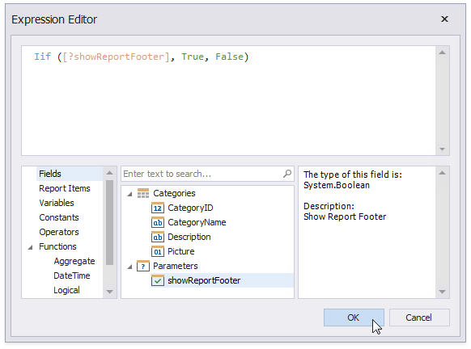
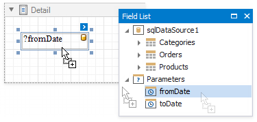
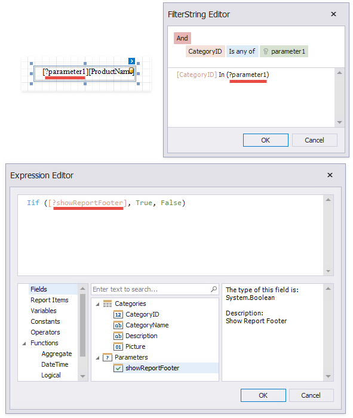

# Use Report Parameters

Report parameters pass data to a report before it is generated in **Preview**. You can specify parameter values.

The topics in this section describe how to create report parameters of different types and specify their values: 

* [Create a Report Parameter](use-report-parameters/create-a-report-parameter.md)
* [Report Parameters with Predefined Static Values](use-report-parameters/report-parameters-with-predefined-static-values.md)
* [Report Parameters with Predefined Dynamic Values](use-report-parameters/report-parameters-with-predefined-dynamic-values.md)
* [Multi-Value Report Parameters](use-report-parameters/multi-value-report-parameters.md)
* [Cascading Report Parameters](use-report-parameters/cascading-report-parameters.md)
* [Date Range Report Parameters](use-report-parameters/date-range-report-parameters.md)

Use report parameters in the following cases:

* **In [Filter Strings](filter-data.md)**

    Report parameters can be referenced in a filter string.

    

    > [!TIP]
    > Data can be filtered:
    > * On the report level. All data is loaded from the data source before a filter is applied.
    > * On the data source level. Only the filtered data is loaded. See [Filter Data at the Data Source Level](filter-data/filter-data-at-the-data-source-level.md) for more information.

* **In [Expressions](../use-expressions.md)**

    You can create a report parameter and use it in expressions. For instance, you can do the following:

    * Specify a [calculated field](use-calculated-fields/calculated-fields-overview.md)'s value.
    * [Bind](../bind-to-data/bind-controls-to-data-expression-bindings.md) a control to data. 
    * Conditionally change [a band's visibility](shape-data-expression-bindings/conditionally-change-a-bands-visibility-expression-bindings.md) or [a control's appearance](shape-data-expression-bindings/conditionally-change-a-control-appearance.md).
 
    

* **In [Mail Merge](../bind-to-data/use-embedded-fields-mail-merge.md)**

    You can use a report parameter in a control's text.

    

* **As a Value Source for Control Parameters**

    The following controls have internal collections of parameters. You can bind these internal parameters to report parameters.

    * **[Cross Tab](../use-report-elements/use-cross-tabs/cross-tab-overview.md)**

	    Use [cross-tab parameters](../use-report-elements/use-cross-tabs/data-shaping.md#use-parameters) to filter data or change control appearance.

    * **[Chart](../use-report-elements/use-charts-and-pivot-grids/use-charts-in-reports.md)**

	    [Filter chart data](../use-report-elements/use-charts-and-pivot-grids/use-charts-to-visualize-grouped-data.md) by parameters.

    * **[Subreport](../use-report-elements/use-basic-report-controls/subreport.md)**

	    Use the control's parameters collection to specify parameter values in the report that the **Subreport** control references.

* **As a Value Source for Data Source Parameters**

    The following data sources have internal collections of parameters. You can bind these internal parameters to report parameters to make them dependent on an external value.

    * **[Database](../bind-to-data/bind-a-report-to-a-database.md)**

        Use [query parameters](../bind-to-data/specify-query-parameters.md) to filter data on the database level or pass values to a stored procedure.

    * **[JSON](../bind-to-data/bind-a-report-to-json-data.md)**

        Use path, query, and header parameters to configure HTTP requests to the web service endpoint.

    * **[Object](../bind-to-data/bind-a-report-to-an-object-data-source.md)**

        Use object data source parameters to pass variables to the method that fetches data.

    * **[Entity Framework](../bind-to-data/bind-a-report-to-an-entity-framework-data-source.md)**

        Use Entity Framework data source parameters to pass variables to the method that fetches data.

* **Display a Report Parameter Value in a Report Explicitly**

    

Wherever you specify a parameter name, prefix it with the question mark character.

